# 掌控板 3.0 体验前瞻报告：繁华落尽一场空？青山依旧笑春风！

深岩中的种子曾有段时间似乎遗落了他最重要的物品，终在春风掠过时，让满山苍翠给了他答案。

—— 题记
<!-- more -->
---

本文在 盛思论坛，盛思科教 微信公众号，掌控板 微信服务号，FlowEcho Wave Nexus，FlowEcho 部分成员的个人博客 等站点同步发布。

本文在 CC BY-NC-SA 4.0 协议许可下发布，署名为FlowEcho Develop Team

!!! note
    在 掌控板 微信服务号 中，本文被进行了重构 更改项如下：

    - 使用DeepSeek-r1等LLM进行润色/修改 使全文更加生动活泼
    - 文中视频加入文字标注
    - 将表格转为图片 方便手机端阅读
    - 折叠长链接 方便手机端阅读
    - 删除 与固件有关部分的 Bug Report
    - 添加直播预告/团队介绍/结语/前言部分
    - 删除与友商micro:bit有关的字眼 

---

# 闲话

你可能觉得我的面孔有些生疏，没关系，因为我在上周删除了我三年来在盛思论坛发布的本就为数不多所有帖子，既然这样，那请容我先做个自我介绍。
我叫 W-Can1425，来自 FlowEcho Develop Team，这是一个掌控版第三方开发者聚集组织。三年前我才有幸接触到了掌控板，同时本人不过是一名初中生，不过才刚刚入门，故我不能保证这篇文章（我所写部分）在技术上的绝对严谨和情感表达上的克制。如果发现错误或者出格之处，望各位小伙伴及时批评指正。

虽由我负责主要文字部分和撰写工作，但汇集的是大家的智慧，我也仅仅负责了本篇文章的构思与文字部分的填充，各位真正关心的技术部分由我们团队的小伙伴负责。
由于我们刚刚拿到全新的掌控板，官方也暂时还没有发布比较有用的文献资料，本篇文章可能真正有用的干货不是很多，各位就当读一个跨越了七年的故事吧。

# 说在前面

请注意，我个人和团队在日常沟通与项目开发中一般使用 HandPy（疑似早期官方对掌控板的称呼）来称呼掌控板，目的是为了和 MicroPython 即其缩写相区分。
这意味这下文所提 HandPy 或 hpy 皆指 掌控板，mpy 指 MicroPython。mPython 也会照常使用，这不会造成太大的歧义。

在文章正式开始之前，首先感谢 盛思 LabPlus 的大力支持，我很荣幸收到公司赠送给我的第一批批量生产的全新掌控板。
另外，我们与贵公司取得了联系，深入交流了三年来我们团队凝聚出的许多的经验、建议、想法，有幸得到了官方的高度重视，我代表团队表示我们感谢！
同时，部分古远资料我特别查阅了 掌控板官方文档 和 盛思科教 微信公众号，他们为本篇文章提供了最准确的信息供我们核对。
特别提一嘴，来自盛思的与我们对接的 张​峪​霖老师，让公司给您加加鸡腿，你的真诚与细心，让我和我的团队感受到了贵公司的温度和深度，（加鸡腿就说是用户说的 doge╭(ᵔ_>ᵔ)╮）。

本篇文章的写就，也离不开我们团队各位伙伴们的协助测试、讨论、分析、支持，他们也参与了本文的撰写，为本文提供了最真实的数据支撑！
同时还有历代掌控板爱好者的付出，包括但不限于 “小齿轮 汝州一中朱现伟”，“拱猪的白菜🛵 💨”，“心平气和”，“且歌且行”（排名不分先后，此处名称为本文写就时的论坛账号昵称）等等，你们留下的文章与资料为本文提供了宝贵的参考资料。谢谢你们！

当然，也感谢屏幕前认真阅读的你。

# 新品上手

## 外观与参数

我是 W-Can1425，很荣幸由我负责 外观与参数 和 关于新版 mPython 软件 板块。事不宜迟，我们抓紧开始。

### 开箱

我在 5月22日 拿到了新一代的掌控板。拆开外层包装，在我手上是一个透明的塑料小盒子，盒内有掌控板 3.0 主机，一张说明书，一张合格证。

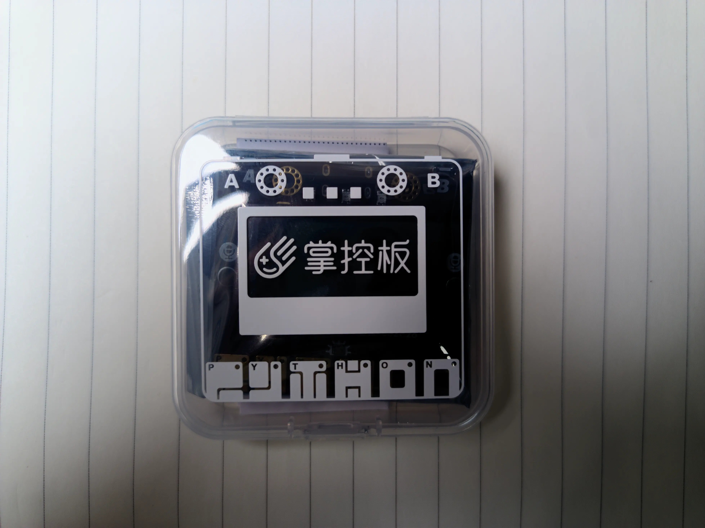
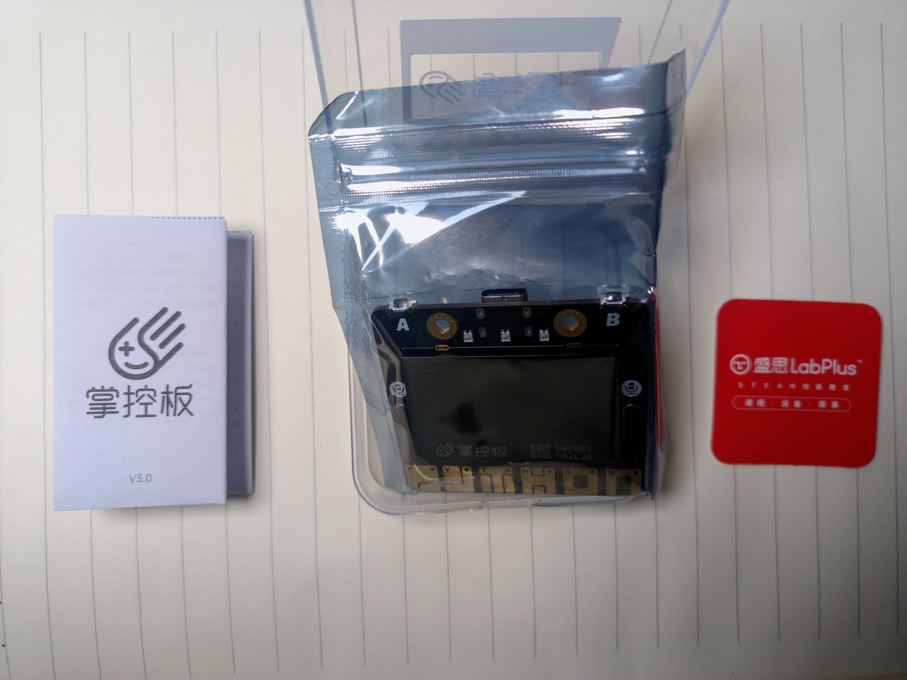

由于篇幅原因，这里与 2.0 一脉相承的部分未特别说明，让我们来欣赏一下带包装的掌控板：

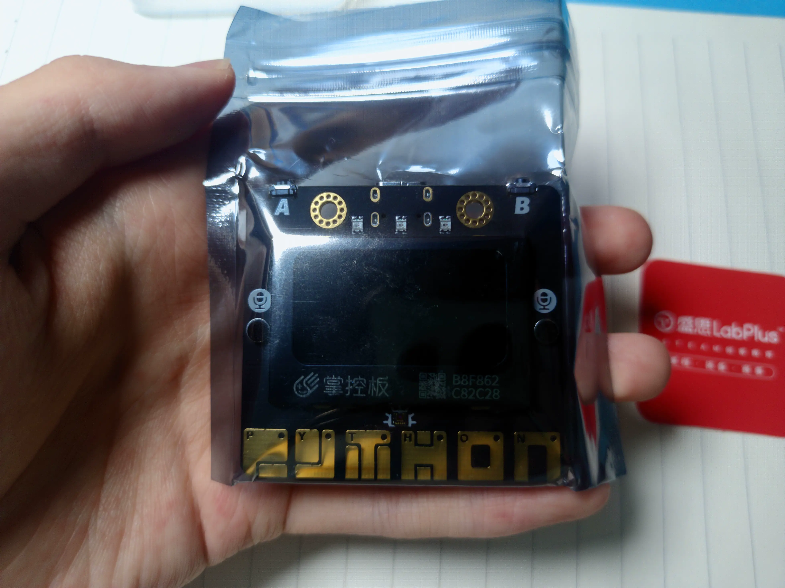
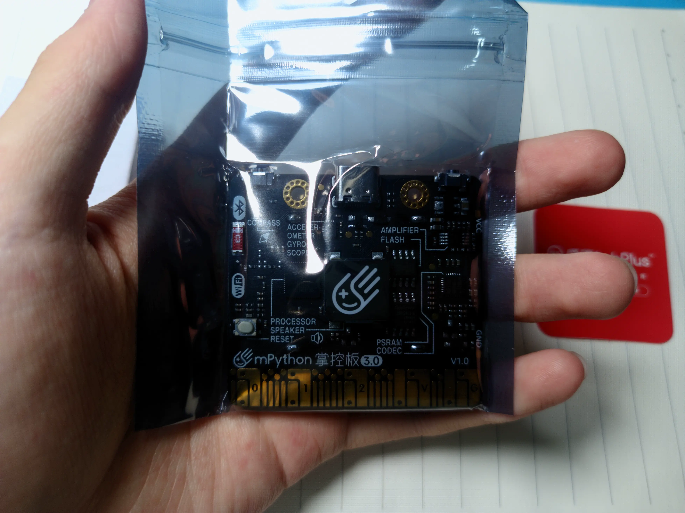

与 2.0 时代相比较，在包装上让我感到惊艳的是这个透明塑料盒，整体设计上印有与真实掌控板大小相等的掌控板正面设计，在保证简洁的同时还保证了极高的辨识度。同时，我认为也十分实用，非常便于各位老师同学们随身携带，不用担心磕磕碰碰了。(^▽^*)

### 外观

小心翼翼的从深灰包装袋中取出掌控板，我们先来粗略欣赏一下其正反面：

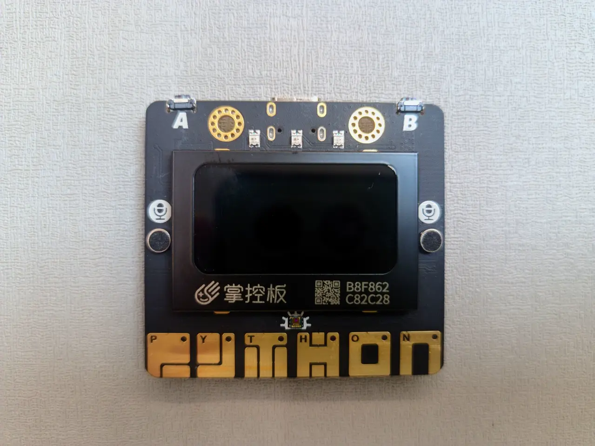
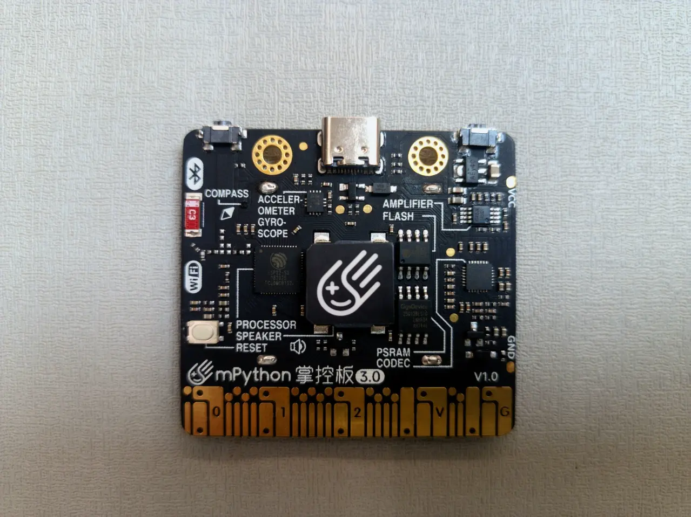

在设计方向上，整体思路没有发生变化，LabPlus 选择了延续家族式的设计风格，个人认为这是最为明智的选择，保留了七年来积累的辨识度。同时，LabPlus效仿了 micro:bit 的背面设计，增添了一些关于硬件的注释、令我感到惊喜的是 LabPlus 在细节设计上作出了大量的努力，在字体选择，标识排版，品牌辨识上都有所体现，让我们看图：

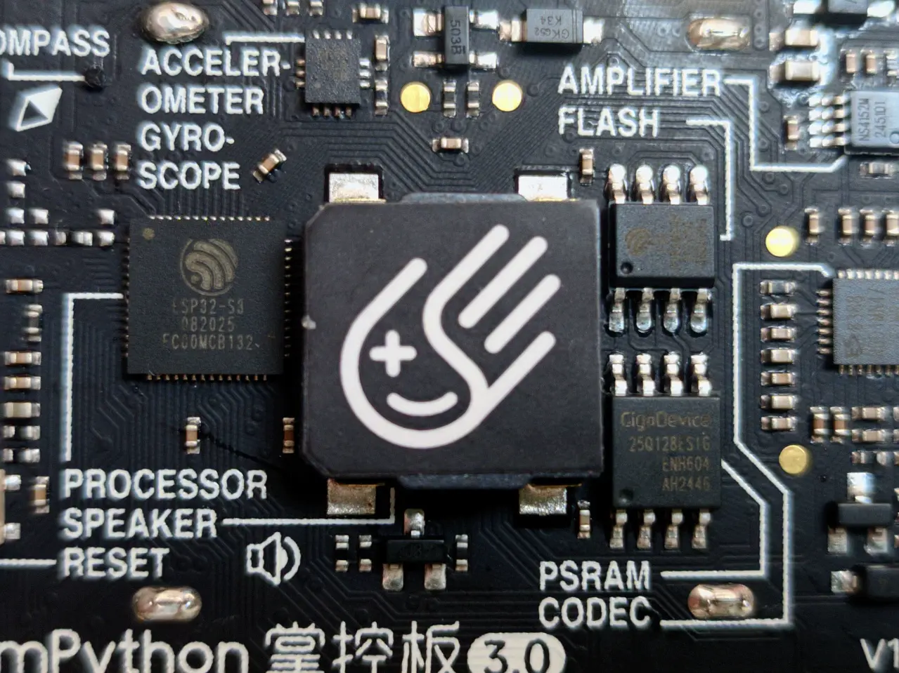
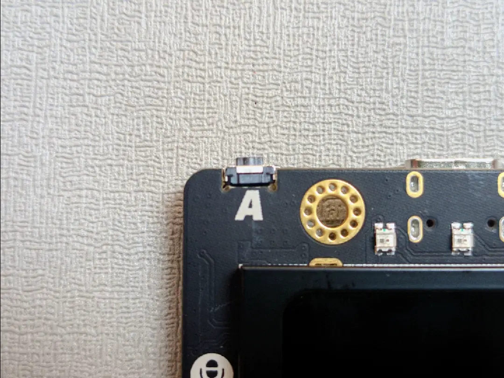
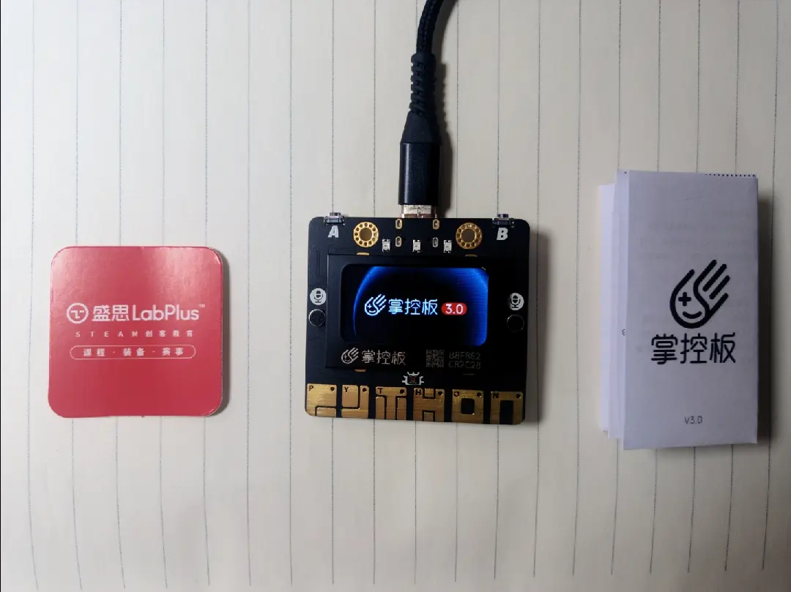
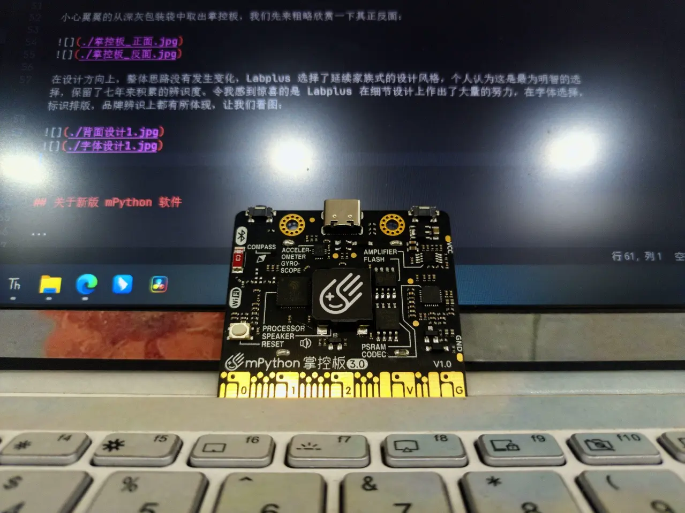

### 参数

> v3数据源：<https://mpython-pro.readthedocs.io/zh-cn/latest/index.html>

> v2数据源：<https://mpython.readthedocs.io/zh-cn/master/board/hardware.html>

参数一定是各位小伙伴最关心的部分之一。我在这里直接引用来自 LabPlus 方面的数据：

| 硬件         | 型号规格                                      | v2对比                                                         |
| ---------- | ----------------------------------------- | ------------------------------------------------------------ |
| CPU        | ESP32-S3，高性能 Xtensa® 32位双核处理器 240 MHz     | ESP-32 WROOM，Tensilica LX6双核处理器                              |
| 屏幕         | 1.47寸高清LCD彩屏，分辨率：320x170，型号：ST7789        | QG-2864KSWLG01 OLED显示模块 128x64单色                             |
| 实体按键       | (A/B/reset)                               | **相同**                                                       |
| 触摸按键       | (P/Y/T/H/O/N)                             | **相同**                                                       |
| 运行内存       | 512KB SRAM + 8MB PSRAM                    | 520KB SRAM                                                   |
| 存储         | 16MB (Flash)                              | 8MB (Flash)                                                  |
| 环境光线传感器    | LTR-308ALS-01                             | 光敏三极管ALS-PT19-315C                                           |
| 声音传感器(麦克风) | EM4013BTC1R16B-T0-423 双麦克风                | 型号相同但为单麦克风                                                   |
| 全彩RGB灯     | 3颗全彩WS2812-2020 RGB-LED灯珠                 | **相同**                                                       |
| 贴片式喇叭扬声器   | 13\*13\*4MM 1w                            | **无**                                                        |
| 地磁传感器      | MMC5603NJ，3轴，最小分辨率0.0625mG，±30G量程，±1°指向精度 | v2.2.0及以后的与v3相同 在这之前的则是MMC5983MA:量程±8G;精度0.4mGs,电子罗盘误差±0.5°; |
| 六轴传感器      | QMI8658C，陀螺仪最高±2048°/s，加速度计最高±16G         | v2.1.0及以后:QMI8658C (LGA-14)                                  |
| 蜂鸣器        | **喇叭替代蜂鸣器实现音频播放**                         | 无源蜂鸣器 SMD-050020F-03040N                                     |
| 蓝牙         | BLE 5.0                                   | 蓝牙v4.2 BR/EDR和BLE标准                                          |
| 三轴加速度计     | **v3数据源中无此项**                             | MSA300: 测量范围: ±2/4/8/16G;                                    |

> 感谢 **盛思技术支持** 补全/修正 数据！

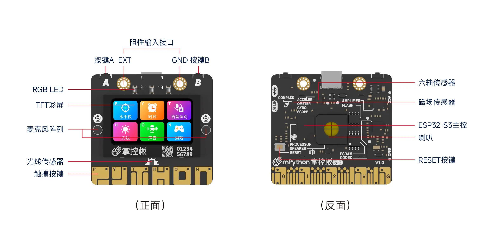

这里我不再重复赘述上面这些内容了，下文中我们团队的小伙伴会给出更专业和详细的解读与分析。(*/ω＼*)

## 关于新版 mPython 软件

mPython 软件发布于 2020，其使命是为了替代 mPythonX，至今也已走过五个年头。五年后的现在，掌控板 3.0 同 LabPlus 的一批新产品发布，作为其生态闭环的重要一环，mPython 软件有什么变化呢？

请注意，现在我演示使用的版本是 mPython 0.8.7-alpha.1。

### 图形化编程

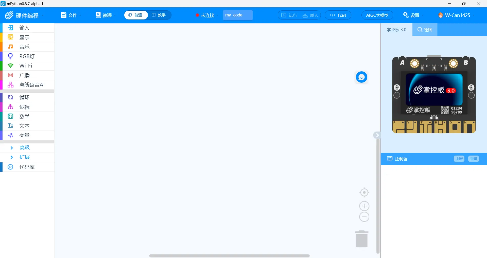

相信各位不难发现整个软件界面没有大的改动，似乎唯一的变化就是 在编程区出现了一个对话按钮 和 右侧的模拟部分，我们一个个来说。

点击这个按钮，你会打开 编程助手，事实上，就是 LabPlus 往 mPython 里内置了 DeepSeek（给一些读者解读一下，这里的 内置 显然不是 mPython 真把整个 DeepSeek 模型塞到了你的电脑里，仅仅只是对接了一套 API）。

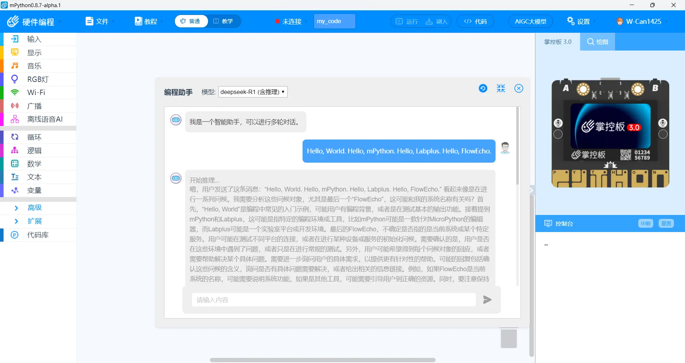

点击弹出窗口上方的缩小按钮，窗口会缩小：

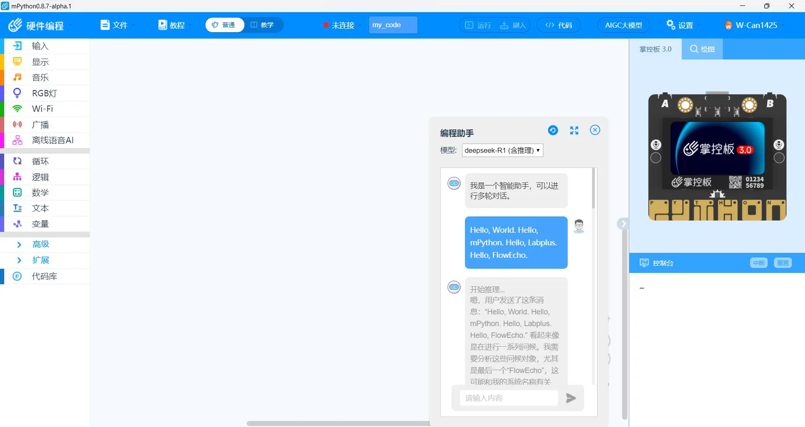

我有两个小的建议：

- 使窗口可被移动
- 直接使用原生窗口，不使用在 mPython 主窗口内新建伪窗口的方案

### 代码编程

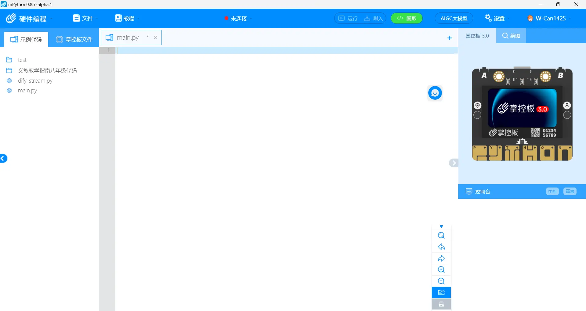

这一部分也没有什么大的变化，但我认为比较实用的功能值得被介绍，即 快捷代码查询，
在代码编程区右下方点击“API”按钮即可打开：

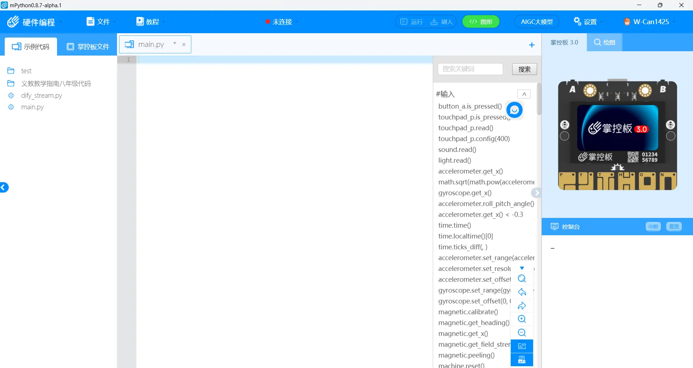

这里写明了大量的 API 调用示例，由于目前（截至本文发布时）官方仍未发布新版本的文档，但掌控板3.0（特别是屏幕方面的实现）作出了大量的更改，这里不失为暂时替代技术文档的最佳选择。

### Bug Report / Bug 反馈

我们同时也发现了一些软件问题：

- 没有内置 AI摄像头 4.0 固件，导致新手刷入困难（反馈来自 盛思掌控版售后服务群）

- 示例代码命名随意（见下方图片左侧，你将会看到类似 `111.py` 的命名）

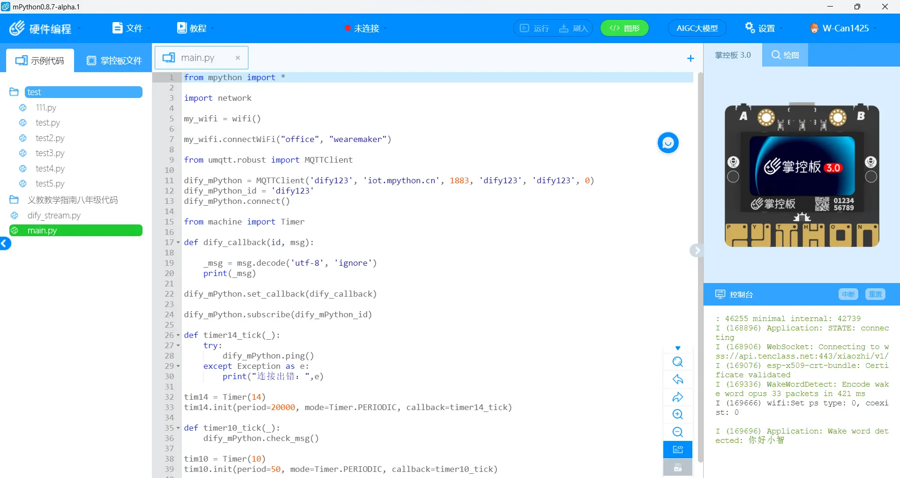

鉴于现在新版软件仍处于 alpha 阶段，这些问题完全可以理解，希望后续能持续跟进，积极更新。╰(*°▽°*)╯

接下来的部分由 LP_OVER/Frez79 撰写。需要说明的是，这二位同学的语言实在有些简练和干脆，为了方便各位的阅读，我增添和优化了部分内容。

# 屏幕

本人 LP_OVER，一名 14 岁初中生。目前项目有LP OS（窗口化用户界面）、Radiation（原版urequests的替代品）。FlowEcho 创始成员之一，长期在 Github 上保持活跃。已经学习了Python、C/C++、HTML/CSS/JSON 两年+，运维入门。

本人 Frez79，现在(2025)是一名 14 岁初中生，主力语言 Python，前端三件套/Android玩机/运维 雨露均沾，常活跃于LDO论坛/Github 下方技术性内容均由我编写


掌控板v3搭载了一款分辨率172x320、1.47寸大小的LCD彩屏

> 关于刷新率部分：

> 我们目前暂未搜集到有关刷新率的具体信息 目前有以下几种说法：

>  1. 目前一说为 最高60hz（类似于掌控板2.0屏幕设计导致的刷新率限制）

>  2. 一说为 静态刷新 即 刷新率取决于屏幕内容传输速率与性能


在屏幕适配上 盛思没有沿用过往的framebuf渲染屏幕画面 而是选用了更为高效、强大、轻量的基于C的LVGL

为了方便各位的理解，我对 LVGL 做一个简单阐述。

"LVGL（轻量且多功能的图形库）是一个免费且开源的图形库，提供了创建嵌入式 GUI 所需的一切，包括易于使用的图形元素、美丽的视觉效果和低内存占用。" —— LVGL 文档（已翻译）

它不仅仅可以绘制文字、图片、形状，还提供了基础的屏幕交互功能，你可以通过虚拟光标，在多个按钮/选项间来回流转、享受开箱即用的动画

不仅如此，LabPlus注意到 LGVL主要提供**对象化界面组件** 不符合v2/v1老用户直接绘制内容的习惯 因此特意针对`CANVAS`这一功能 进行了完善 并封装了大部分常用模块 单独存放至 `lv_gui.py` 中，值得肯定。

这是我（LP_OVER）个人最喜欢的一个功能更新。

音频播放是一个常用功能 v2时 它是拓展版的专属 你需要再花近100r才能在掌控板上播放音频
而现在 掌控板v3 补齐了语音交互的最后一块拼图.

同时 得益于 ESP32-S3 增加了用于加速神经网络计算和信号处理等工作的向量指令 现在我们可以在离线情况下调用 TTS/语音唤醒

对于禁止联网的赛事而言，原先有关语音交互的部分只能一刀切，而现在，我们可以通过这一特性 写出更炫的作品.

在 盛思掌控版官方售后服务群中，我（LP_OVER）不止一次看到有许多老师和同学在比赛进行时焦急的在群里问：“比赛环境不允许连接网络，该怎么实现语音合成”之类的问题，每次我看到了只能默默的回复“无法实现，必须联网”。
现在，掌控板3.0 的发布，相信会给向他们一样的提问者和像我们一样的解答者一种满意的解决方式。

<video src="../../images/handPy_v3_ForwardLooking/小deepseek.mp4"></video>

# 关于全新固件的不完全分析

> 截止到本文发布时，官方仍未将新版本固件开源，以下内容是我们根据极少的已知材料和实际测试而来，故本部分命名为“不完全分析”。

> 参考文献如下：

>  [Package management — MicroPython v1.24.0 documentation](https://docs.MicroPython.org/en/v1.24.0/reference/packages.html)

>  [MicroPython libraries — MicroPython v1.24.0 documentation](https://docs.MicroPython.org/en/v1.24.0/library/index.html)

>  [ESP32-S3 Wi-Fi & BLE 5 SoC｜乐鑫科技](https://www.espressif.com.cn/zh-hans/products/socs/esp32-s3)

掌控板v3搭载了 **MicroPython 1.24.1** 。

本次固件已知亮点如下。

1. 可使用更新的包管理器，即 `upip -> mip`。
	该包管理器在 下载 这一环节中作了很大改进：
	1. 支持根据清单自动下载第三方库
	2. 支持从Github/Gitlab直接下载
		- `mip`会直接把相应的Git链接替换为`raw.githubusercontent.com` 使用此功能前请先配置好网络环境.
	3. 支持指定下载位置
	4. 支持直接下载文件(.py/.mpy)
	5. 使用MicroPython自有模块仓库而非PyPi
2. 可使用更多的较新特性，如：
	- f-string
	- espnow（含异步支持的**原生完整版本**）
	- asyncio
	- openamp
	- 流压缩/解压(deflate模块)
3. 将LVGL作为图形渲染方案
4. 更完整的模块实现 如：
	- asyncio
	- 完整的requests实现

> 此处将`espnow`称为**原生完整版本**是因为它已经在v2中以`radio`模块的身份和大家见过面.


但我们在固件中仍发现了一些问题 请看下方栏目
## Bug Report / Bug 反馈

### 人为的 update 延迟

该问题出现于`lv_gui.py`的`CANVAS`类中的`update`函数
`update`函数功能类似于v2的`oled.show` 但此处刷新完毕后会人为延迟**0.02s**

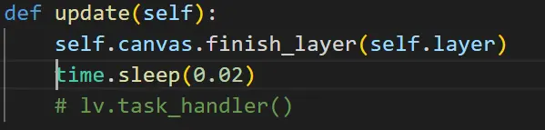
### `educore`库初始化异常

在尝试导入`educore`库时 `educore`库似乎会调用旧版掌控板中已被移除的`OLED`类 该错误可稳定复现：

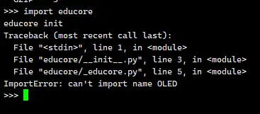

### 用户存储空间过小

通过`os.statvfs`函数查询根目录内容可得以下结果：
```text
>>> import os
>>> os.statvfs('/')
(4096, 4096, 512, 249, 249, 0, 0, 0, 0, 255)
```
其中分别对应`f_bsize`的第一项和对应`f_blocks`的第三项相乘可得用户存储空间大小：
***2097152bytes*** (约2M)

### mpython_conn不兼容

`在2025.05.26下使用最新版本测试`
经测试 mpython_conn目前有关oled的部分已全部失效 其他杂项也失效了一部分(如set_rgb等)

# 繁华落尽一场空？

说了这么多，不知道在看的各位是从什么时候认识掌控板的呢？

---

## 1.0 发布回顾

2018年9月15日，掌控板在第六届全国STEAM教育大会上正式发布。作为一块普及STEAM创客教育、人工智能教育、编程教育的开源智能硬件，立即收到了来自全国各地小伙伴的回声。

9月30日，盛思推出了掌控板测评专家招募活动，目的是召集56名创客精英与我们共同进行对掌控板的深度测评与玩法探究。

仅在活动刚推出的2个小时内，公众号后台就收到了大约260多名用户报名，甚至到了活动结束的前一晚都有不少用户依旧在后台踊跃报名。

10月19日，盛思再推出首批掌控板预售活动，不料在测试预售通道时，测试用的预售通道被意外扩散，所以索性决定就开放300块掌控板的预售。结果预售链接刚刚转发，仅仅1个多小时就被一抢而空。当年评论区最高赞是这样说的：“每ID只能抢5块，否则我是要200片的，只能赶紧喊人来抢！还是有好多朋友没抢到！所以标题说1小时售罄，表达有问题！\[撇嘴\]\[撇嘴\]\[撇嘴\]”

11月3日，掌控板 微信公众号发文《掌控板获世界级物联网芯片公司鼎力支持，开源新时代即将到来！》

12月，掌控板 微信公众号发文《掌控板亮相全国青少年创客教育论坛，势将开源精神进行到底！》

......

---

## 2.0 发布回顾

1.0 发布 424 天后的 2019年11月09日晚20:00，掌控板生态发布会如期而来。本次发布会不仅仅发布了全新的硬件，更发布了全新的软件——mPython。全新的 mPython 软件极大的推动了掌控板生态闭环的完善，在五年前的创客教育界掀起了轩然大波。

“一打开 mPython 软件的界面，相信大部分老师跟我的感受一样：清新亮丽，豁然一新！相比 mPython X 成熟稳重的配色，mPython 在软件颜色以及图标等各种细节的设计上，就显得更加活泼现代。另外，我们在界面上还看到了类似 micro:bit 的仿真模型，进一步向大班教学以及创客教育普及化迈进，没有条件的地区，以后甚至都不用购买掌控板了！“ —— DFROBOT 论坛用户 铁熊

硬件方面，掌控板 2.0 改善按键并将无线天线与PCB合一，提升了掌控板的美观度和稳定度，顺应时代潮流更改为了 Type-C 接口，增加了地磁场传感器。

从此开始，掌控板开始深根创客教育，努力将掌控板的使用门槛放低，将创客教育多元化、普及化，掌控板的用户群体也日渐丰富。

## 繁华落幕？

> 努力将掌控板的使用门槛放低，将创客教育多元化、普及化，掌控板的用户群体也日渐丰富。

可惜的是，这样的“繁华”换来的却是快速的“衰败”。

### 用户主体的转变，社区维护的失力，产品定位的单一

掌控板，为创客教育而生。“普及”与“低龄”一定会是他身上的标签，并且这一定会是一个好事，但现在的生态情况却十分糟糕，我们认为有一部分原因来自用户主体的转变。

在 1.0 时代（2018 至 2020），掌控板坚持以“开源”为中心。“开源”对于这种创客教育的设备意味着什么？意味着它不仅仅在教育上具有价值，在广泛的开源生态中也应拥有价值。这一点在掌控版上体现的更为明显。掌控板具有优于业界的性能，却卖着几乎最便宜的价格，掌控板初期将这两者发挥的淋漓尽致，从 1.0 前期的各项活动参与群体的组成就可以体现：

既有热爱社区的开发者，也有心系孩子的基层老师和家长。

这样的情况给掌控板带来了什么？我们认为，他们为掌控板生态带来的是本质上可持续的长期“繁华”。

第三方开发者们可以协助官方积极参与维护掌控板这个开源项目，让它变得更好用、更易用，同时来自第三方的开发者更容易听到用户的声音，因为他们热爱社区、同时他们本身也是用户。

老师、家长和同学们则因掌控板变得越来越易用而更加信赖掌控板的创客教育这一属性，这在一定程度上也促进了掌控板作为教育硬件的优势越来越突出。

在 2.0 时代，掌控板在官方层面上大力推动掌控板越来越易用，这是一件值得欣喜的好事，但掌控板同时也放弃了第三方开发者们，开始弱化掌控板“开源”与“性能”之属性。在 2020 至 2021 年之间，这种做法的负面影响似乎不大，但随着掌控板越来越强调“创客教育”属性以至于放弃了“开源”与“性能”，最终导致了整个开原生态的败落，整个第三方强大力量的枯竭，转而也影响到了其本身“创客教育”的属性。一系列问题开始显现：论坛注水极为严重、甚至最后一篇推荐帖子仍来自2020，固件仓库中的 Issue 两年没有回声，固件代码中“尸横遍野”、低质量代码疯狂堆积，业界评价褒贬不一、分裂严重......

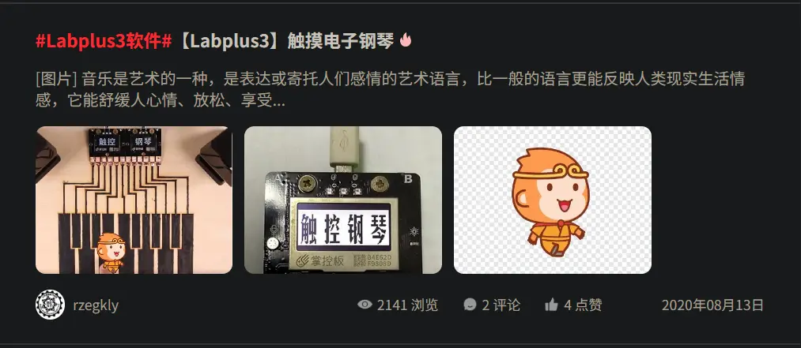
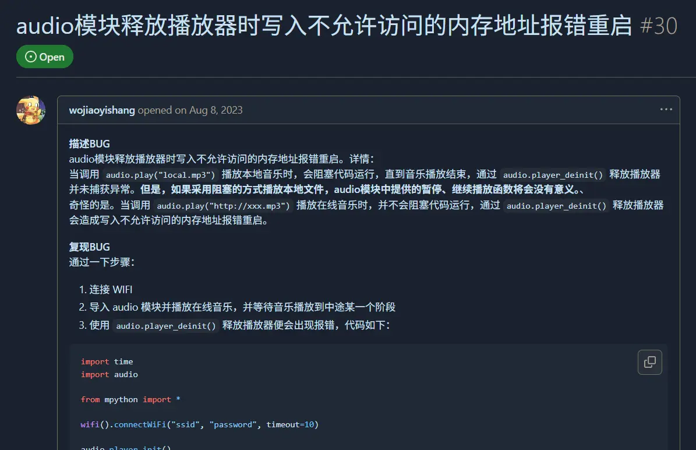
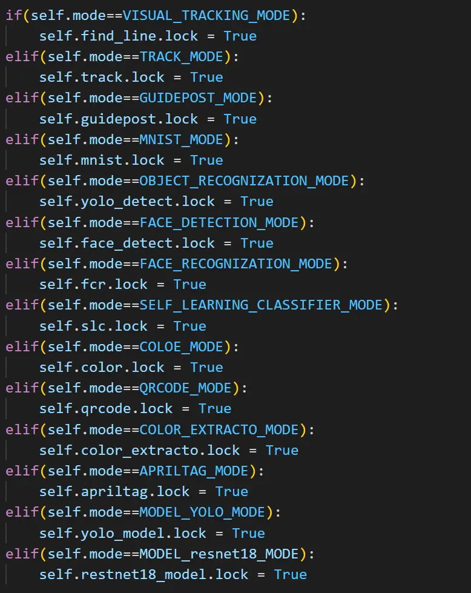
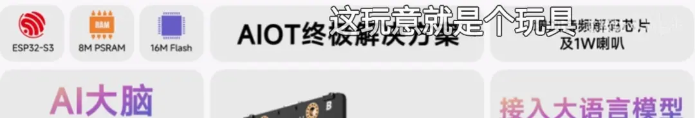


未来掌控板将何去何从？

# 青山依旧笑春风！

当代码仓库的星光照亮过期的Issue，当锈蚀的API接口爬满杂草般的注释，我们正在等待一场迟来的春雨。

三年前埋下的那颗种子，在无数个深夜的黑白屏幕上的微光里，终于等到了破土的契机。FlowEcho 不是第一个在代码荒原上举火的人，文章写至此，我忽然读懂了七年前那场预售狂欢的隐喻：那些抢购五块掌控板的ID背后，跳动着同样的开源基因。

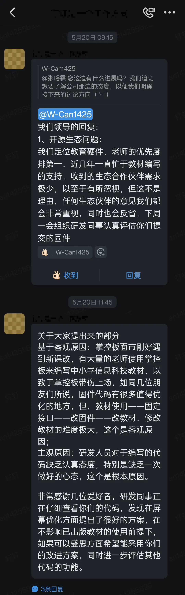

青山不会老去，它只是需要一场足够炽热的季风，让深岩里的晶振重新震荡出创客教育的真义。

# 写在最后

本篇文章到这里，也就接近尾声了。但掌控板和我们的征程还无比漫长。

由于篇幅问题，你现在正在阅读的是我们进行了优化的缩减版，但请各位放心，最重要的部分我们都向正在阅读的你一一展示了出来。

三年前我借学校比赛的平台认识了掌控板，从此就一发不可收拾。上文中，已提到了我们这个组织的来历。我最初在学习掌控板之时闲暇之余发展出了如今这个组织，现在看来，颇感感慨。

这篇文章由我们团队的三位创始成员负责撰写，他们分别是 我（W-Can1425），Frez79（Gxxk），LP_OVER。

我在 5月22 日拿到了全新的掌控板并开始撰写本文主要的文字部分，在这方面来自盛思的工作人员张老师为我们无偿提供了帮助与支持，在结尾我再次感谢您的付出！

另外两位同学在 5月23日 拿到了掌控板并着手开始撰写文章和测试。

截至本文发布时，关于掌控板3.0的相关资料极其稀有，同时根据官方对我们的回复，由于要准备乐动掌控的发布，官方文档的发布仍需时间。为了帮助各位更好的玩转手中的新掌控板，我们决定以最快速度完成这篇文章。时间紧急，本篇文章一定存在大量缺陷和漏洞，欢迎各位小伙伴在下方评论区积极反馈问题。（*＾-＾*）

再次感谢所有同学的鼓励与支持！

> 青山不会老去，它只是需要一场足够炽热的季风，让深岩里的晶振重新震荡出创客教育的真义。