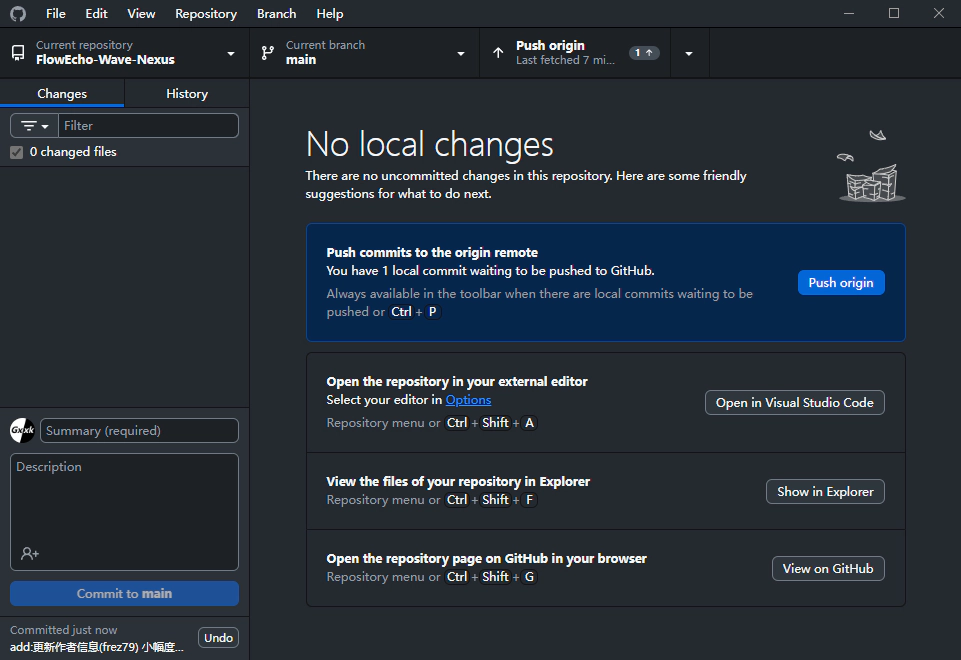

# 如何为该站点添砖加瓦？

## 1. 环境配置

> 本教程默认读者使用Win10及以上系统且有充足的 存储/ram空间

### 1.0 网络配置

> 如果你不受GFW的限制 可以畅通无阻地访问Github/pypi等站点 请跳过此部分

在中国大陆内 通过非国外渠道接入中国网络的用户上网都会受到一定程度的 来自GFW 的干扰

因此 我们需要配置一些工具来绕过GFW的干扰

#### 1.0.1 Dev-SideCar

下载链接：<https://github.com/docmirror/dev-sidecar/releases>
下载完后运行 按照指引 安装根证书即可.

卸载与恢复：<https://github.com/docmirror/dev-sidecar/blob/master/doc/recover.md>

#### 1.0.2 使用镜像源

> PyPi镜像源设置已被写入本项目的`pyproject.toml`文件中 无需设置.

##### Github镜像源
```bash
git config --global url."https://bgithub.xyz".insteadOf "https://github.com"
```
- 文中`https://bgithub.xyz`为镜像源网址 如该镜像失效 请替换为其他镜像站
- 请在Github Desktop安装完成(1.1.2步完成)后进行操作.
> 不可对Git镜像源进行push. 如需push 请恢复原有设置：
>
> `git config --global --unset url.https://bgithub.xyz.insteadof`

#### 1.0.3 科学上网

此方法不便描述 请自行搜索.
> Frez79(笔者)留：是的 这一块只是为了让你知道有这么一个方法在这

### 1.1 Git/Github配置

#### 1.1.1 Github注册

请参考官方文档：<https://docs.github.com/zh/get-started/start-your-journey/creating-an-account-on-github>

### 1.1.2 安装Github Desktop

1. 访问<https://desktop.github.com/download/> 点击图中包含`Download`字样的白色按钮以下载
2. 运行下载下来的文件 在经过非常短的安装后将会弹出如下界面：
    
3. 点击`Sign in to Github.com` 在新打开的浏览器网页中 点击`Continue`
    
4. 在跳转到的授权页面中 点击`Authorize desktop`按钮
    
5. 此时授权完成 回到`Github Desktop` 会进入如下图所示的界面 勾选`Use my`开头的选项后再点击蓝色`Finish`按钮即可
    

### 1.2 Python/mkdocs环境配置

1. 打开Github Desktop 点击左侧`Clone`开头的按钮 在新弹出的窗口中选择`URL`
    第一栏输入`https://github.com/FET-CN/FlowEcho-Wave-Nexus.git`
    第二栏点击右侧`Choose`按钮以选择一个你希望存放仓库的文件夹
    
    最后点击Clone 等待下图界面出现
    
2. 在上一步最后显示的窗口里按下 <kbd>Ctrl</kbd>+<kbd>Shift</kbd>+<kbd>F</kbd> 打开仓库
    进入`tools`目录 双击运行`firststep.bat`

> Note: <kbd>Ctrl</kbd>+<kbd>Shift</kbd>+<kbd>F</kbd>也是部分输入法的简繁切换快捷键
## 2. 文档编写

### 2.1 文档格式

该站点内容采用Markdown格式编写 学习Markdown可参考：

- <https://markdown.com.cn/>
- <https://www.runoob.com/markdown/md-tutorial.html>

### 2.2 文档分类

- `wiki` 知识库: 位于`docs/wiki`目录下 多带有教程性质
- `blog` 博客: 位于`docs/blog`目录下 多带有记录/随笔性质

> 目前其余分类暂不对外开放贡献权限.

### 2.3 放置图片

除不可抗因素 该站点所有图片应均使用webp/svg格式存储于`docs/images`

每篇文章如有包含图片的 都应在`docs/images`内创建文件夹并将图片放入其中

文件夹/文件 的命名非必要不使用 非ASCII字符/特殊字符/汉语拼音
### 2.4 [wiki]将文章加入导航栏

> 请先学习YAML(.yml文件格式)：<https://www.runoob.com/w3cnote/yaml-intro.html>

打开根目录下的`mkdocs.yml`文件 搜索`nav:` 定位到导航栏部分.

找到`知识库`一栏 在最后方追加你希望加入的文章 例：
```yaml
  - 知识库:
      - wiki/index.md
      - HandPy V2:
        - 固件编译: "wiki/HandPy_V2/FirmwareCompile.md"
        - MicroPython 1.12 QSTR 文档翻译: "wiki/HandPy_V2/Docs_QSTR.md"
        - 集成调试器: "wiki/HandPy_V2/IntegratedDebugger.md"
      - 如何为该站点添砖加瓦？: "wiki/How2Contribute.md"
      - 你需要添加的文章在导航栏内的标题: "wiki/你需要添加的文章在导航栏内的路径.md"
      - "wiki/不指定标题也是可以的.md"
```

创建分类同理.

> 需要注意的是 所有填写的路径均以`/docs`为根目录 也就是说 路径内应省去`/docs/`

### 2.5 [blog]创建作者信息

> 请先学习YAML(.yml文件格式)：<https://www.runoob.com/w3cnote/yaml-intro.html>

打开`/docs/blog/.authors.yml` 在最后方追加内容 格式如下：
```yaml
    作者名(ID标记):
        name: 作者名字
        description: 作者介绍
        avatar: 作者头像(这里填URL)
        url: https://can1425.flowecho.org   # Author website URL
```
如该项不填写 请注释该项(或删掉)

> 目前笔者({{Frez79.name}})还没读懂字段`slug`的作用 有知道的可以在评论区说说吗

### 2.6 统一个人信息

该项目使用`/dics/blog/.authors.yml`与`/mkdocs.yml`存储博客作者信息与团队成员信息
我们仅存储您的名字与ID 如果您原意提供更多你的信息 我们也很乐意收下 并在为此项目贡献文章时使用基于ID访问的名称/信息

您可以通过`\{\{作者名(ID标记).name\}\}`来引用作者名字.

您可以通过`\{\{作者名(ID标记).\[对应信息的ID\]\}\}`来引用作者`\[对应信息\]`.

## 3. 预览文章

1. 在Github Desktop中 打开此仓库 按下 <kbd>Ctrl</kbd>+<kbd>\`</kbd> 打开命令行
2. 使用命令`uv run mkdocs serve` 开启预览服务
3. 在<localhost:8000>预览您的文章.

## 4. 上传文章

> 作为一般用户 您可能没有足够的权限进行push操作 此时 您可以通过 **PR(Pull Request)** 解决这一问题：

> <https://blog.csdn.net/Supreme7/article/details/136813376>

1. 打开Github Desktop 映入眼帘的应该是你的Github仓库页面 如图所示
    
    白色框框标记的位置将会显示你所做的更改 你可以通过简单的鼠标单击 来选择你希望提交的更改
2. 填写左下角的`Summary`与`Description`
    - Summary: 你这次贡献大致做了什么 简短描述
    - Description: 你这次贡献的详细描述 可写可不写
3. 填写完毕后 点击左下角以`Commit`开头的蓝色按钮 提交更改 此时你刚刚填写的两个字段将会锁定 等待出现如下界面即可

    左下角将会显示您刚刚成功提交的信息 此时点击`Undo`可以撤销提交
    

4. 此时 点击右上角带有`Push`字样的按钮即可